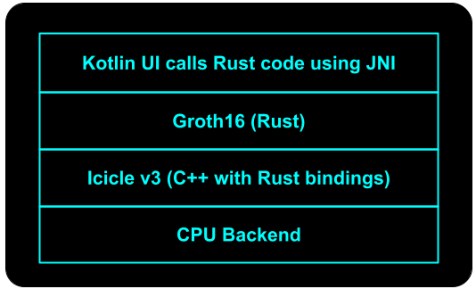

# Groth16 on Icicle: Proof of Concept for Android

## Running the Proof of Concept (PoC)

1. Ensure you have **Android Studio** installed on your computer.

2. Clone the PoC from our [GitHub repository](https://github.com/ingonyama-zk/groth16-android).

3. Enable **developer mode** on your Android device and run the PoC through **Android Studio**.

4. The PoC expects the **witness** and **zkey** files to be in the app-specific internal storage:

TODO: use of cache requires to restart the app when changing circuits!

   ```txt
   /data/data/com.ingonyama.groth16/prover_key.zkey
   /data/data/com.ingonyama.groth16/witness.wtns
   ```

   The file names are fixed. You can upload them to your phone using the **Device Explorer** in Android Studio.

   In our example we used [**Aptos keyless circuit**](https://github.com/aptos-labs/keyless-zk-proofs/tree/main/circuit). The instructions to derive **witness** and **zkey**  files are therein.

## Benchmarks

For **Aptos keyless circuit**, on a **midrange** smartphone (e.g., Samsung A54), the initial proof generation takes approximately **60 seconds**. Subsequent proofs are significantly faster, taking around **30 seconds** due to caching.

## Implementation Details


The diagram above illustrates the structure of our application. Details are provided below.

### User Interface 

The user interface is implemented in **Kotlin**, which has been Google's recommended language for new Android projects since 2019. Kotlin's support for **coroutines** allows for effective asynchronous programming, a crucial feature for managing time-consuming ZK proofs.

### Groth16: Zero-Knowledge (ZK) Application 

The Kotlin file [`MainActivity.kt`](./app/src/main/java/com/ingonyama/groth16/MainActivity.kt) declares and utilizes the function `external fun Groth16()`, which is implemented in **Rust**. We recommend that developers continue using their preferred programming languages for ZK applications, provided they are supported by Android's **Native Development Kit** (NDK), specifically through **Java Native Interface (JNI)**. JNI officially supports **C** and **C++**, and the **Rust community** has developed excellent support for Android. The **Go** language is also supported, although we haven't tested it for this PoC.

Our Rust implementation of **Groth16** is still under active development in a private repository and will be open-sourced once it stabilizes. In this PoC, we include it as a compiled shared library. Below, we explain how we integrated it with Android:

1. **Add the `jni` crate** as a dependency in `Cargo.toml`. This crate provides Rust bindings to JNI, allowing the Rust code to interact with Java or Kotlin in your Android app.

   ```toml
   [dependencies]
   jni = "0.20"
   ```

2. **Define a Rust function** that can be called from the Android app using JNI.

   ```rust
   #[no_mangle]
   pub extern "C" fn Java_com_ingonyama_groth16_MainActivity_00024Companion_Groth16(
       env: jni::JNIEnv,
       _: jni::objects::JClass,
   ) -> jni::sys::jstring 
   {
       ...
   }
   ```

   Key points to note:
   - Use **JNI naming conventions** to expose package, class, and method names.
   - Ensure **proper linking** using `#[no_mangle]` and `pub extern "C"` for the function.
   - Correctly interact with the **Java environment** and handle input/output objects.

   You can find more detailed explanations and examples [here](https://github.com/jni-rs/jni-rs).

3. Finally, use the **`cargo ndk -t arm64-v8a`** toolchain to cross-compile the code to a specific **Application Binary Interface (ABI)**. In this example, we target the **64-bit ARM ABI**. The resulting `.so` shared library `libgroth16.so` can be found [here](./app/src/main/jniLibs/arm64-v8a/libgroth16.so).

### Icicle: ZK Primitives Library 

The **Groth16** function uses **Icicle** to execute zero-knowledge primitives such as **Number Theoretical Transform (NTT)**, **Multi-Scalar Multiplication (MSM)**, **Merkle trees**, etc. [**Icicle v3**](https://github.com/ingonyama-zk/icicle) supports multiple hardware accelerators, referred to as **backends**. For server-side applications, Icicle typically uses a **GPU backend** (e.g., NVIDIA). The development of mobile GPU backends (e.g., **ARM's Mali**, **Apple's Metal**) for client-side applications is ongoing. In this PoC, we use the **default CPU backend**. For convenience, Icicle is provided as compiled shared libraries, which are located [here](./app/src/main/jniLibs/arm64-v8a/).

